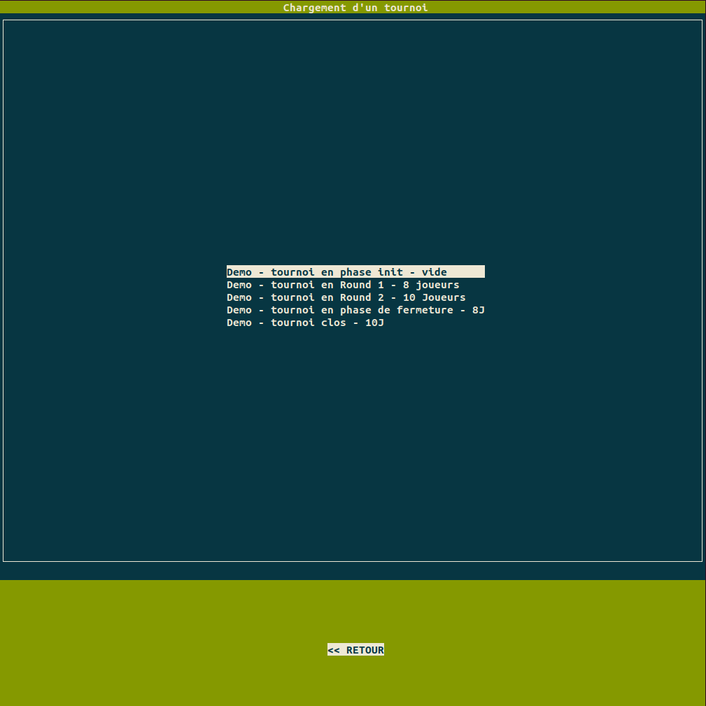
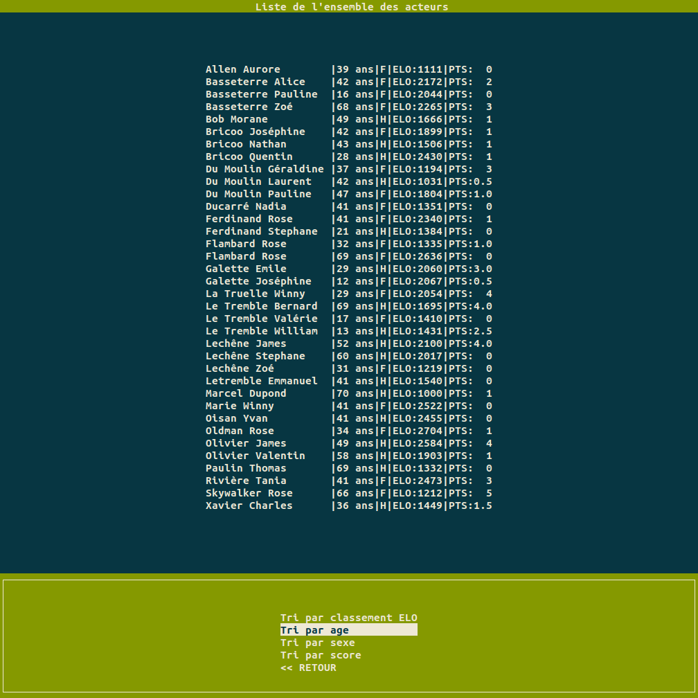
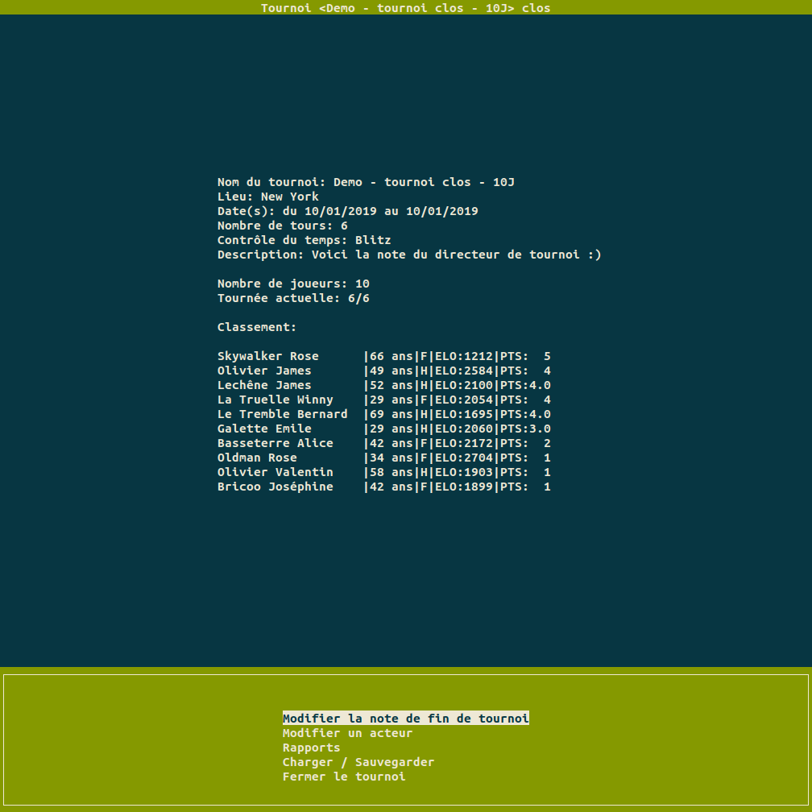

# Chess Tournament Manager (CTM)

CTM is a Python 3 script created in order to help managing chess tournament without internet connexion

## Installation

In order to use this script, you need to follow the steps below:

### First, 
let's duplicate the project github repository

```bash
>>> git clone https://github.com/Valkea/OC_P4.git
>>> cd OC_P4
```

### Secondly,
let's create a virtual environment and install the required Python libraries

```bash
>>> python3 -m venv venv
>>> source venv/bin/activate
>>> pip install -r requirements.txt
```

The curses package comes with the Python standard library. In Linux and Mac, the curses dependencies should already be installed so there is no extra steps needed. On Windows, you need to install one special Python package, windows-curses available on PyPI to add support.

#### Needed in Windows only
```bash
>>> python -m pip install windows-curses
```

You can verify everything works by running a Python interpreter and attempting to import curses. If you do not get any errors, you are in good shape.

```bash
>>> import curses
>>>
```

### Finally,
we can start CTM by using the following command

```bash
>>> python3 CTM.py
```
or by directly calling the controller
```bash
>>> python3 -m controller
```

## Commands

### Menu
You can naviguate in the app using the menu selector with UP, DOWN and ENTER keys.

### Swap between parallel views
The app is split into two main parts; the central part and the menu part.
At some point, you may need to switch between the both parts, and in this case you need to use the 'small 2 above the TAB' key (or £ if you can't get it).

### Bonus
Also, you can hit BACKSPACE to act as the "<< Retour" selection.
And when initializing a new tournament, you can add some extra players by hitting CTRL+F12


## Some screenshots

The following one shows the page on which we can select the current tournament


This one is an example of report (showing all the actors of all tournaments)


And finally, this third screenshot shows the interface of a closed tournament



## Ouputs

### Logs
you can find the logs in the CTM.log file (you can also edit the logging level in the controller/__main__.py file)

### Data
you can find the saved information in the tournament.json


## License
[MIT](https://choosealicense.com/licenses/mit/)
